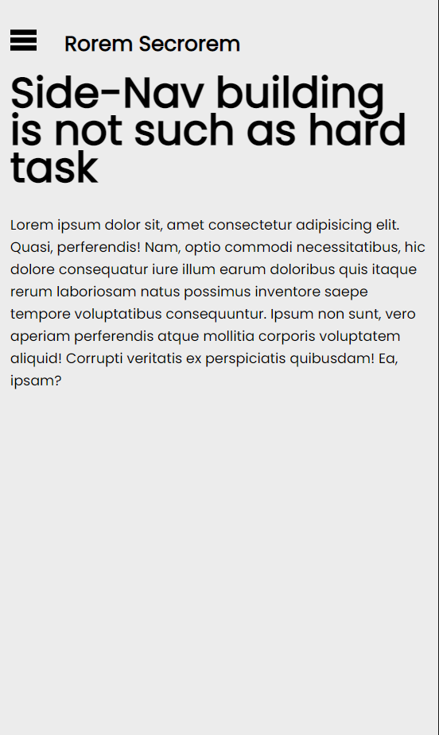
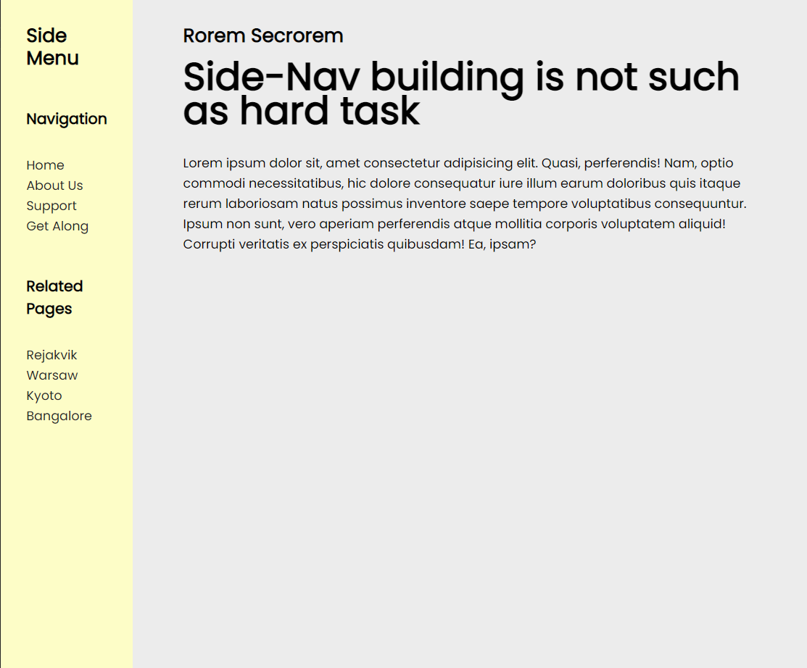
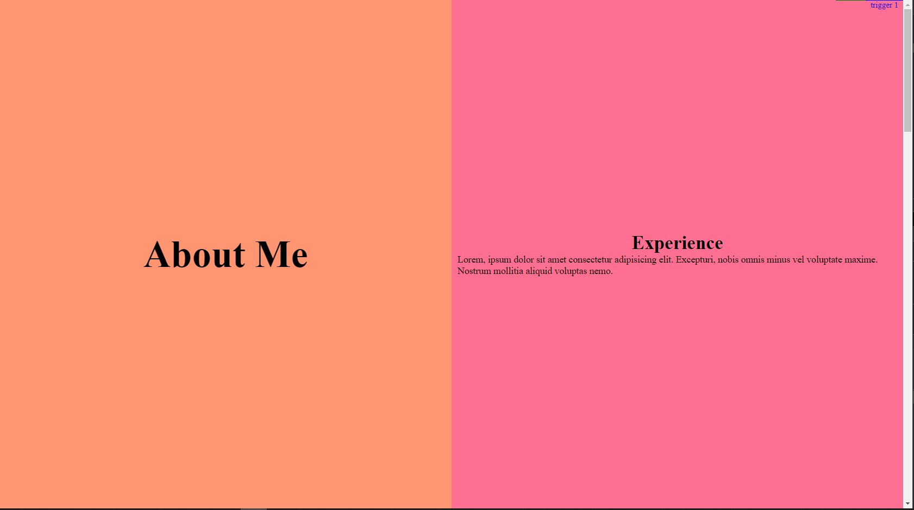
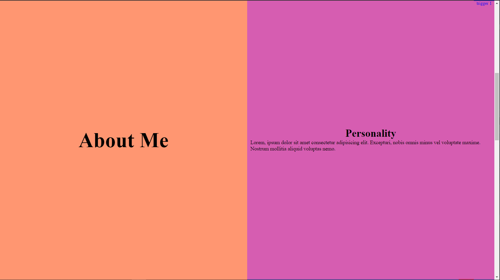
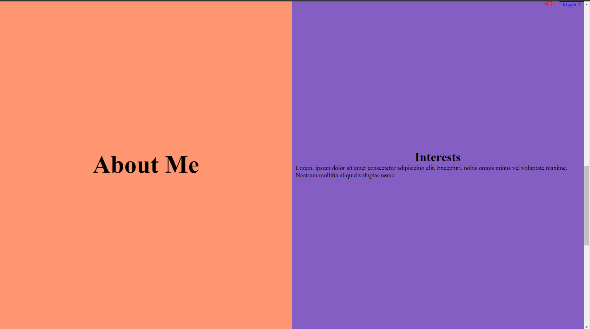
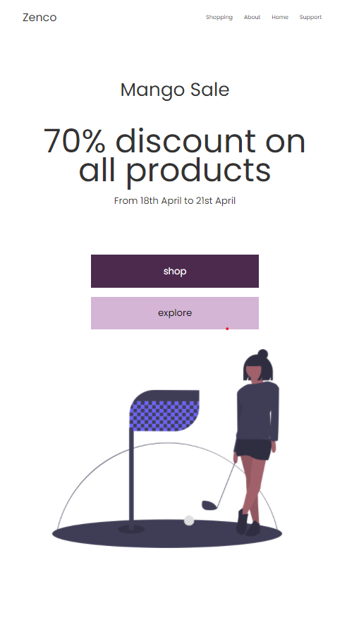
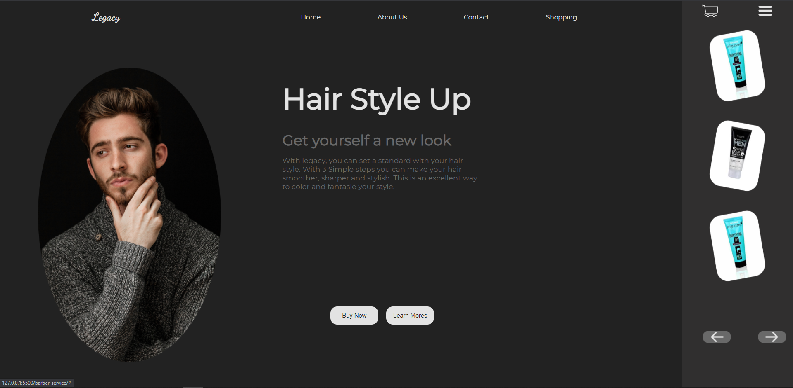
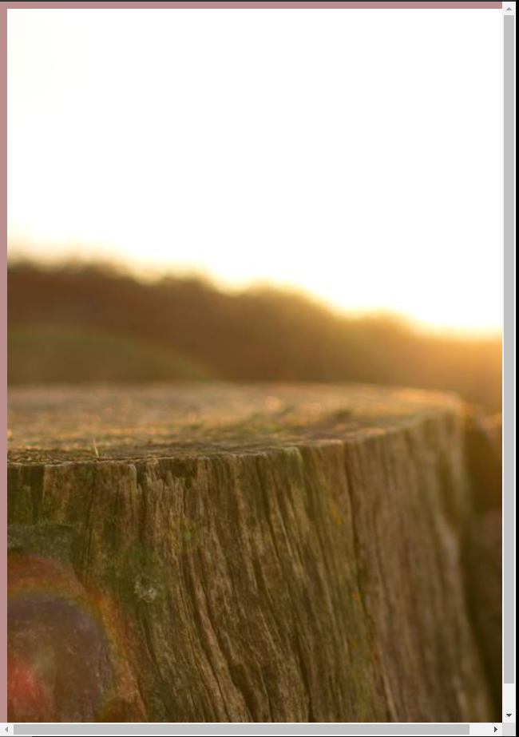
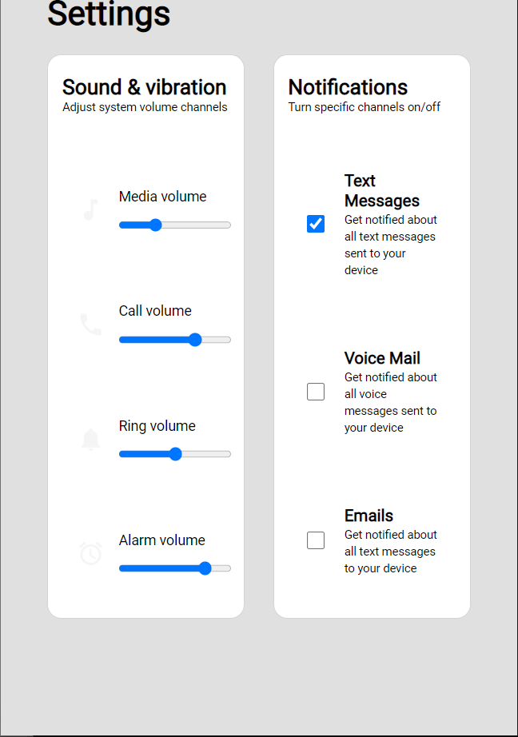

# mini-websites-compilation

### Description
*This is a collection of mini-projects that I made in the process of learning basic html, css and sass. The settings and stories websites are inspired by a web.dev blog post (sources are linked below).*

### Website 

* Check this website out to have real-time interaction with the sites
(https://krishnabellamkonda.github.io/mini-websites-compilation)

### Websites in Action
* Side Nav 

* Loading Screen 

* Parallax Screen 

* Shop Service 

* Barber Service 

* Stories 

* Settings 

### Projects 
* Side-Nav - sidenav component is built for both mobile and website
* Settings - Dev.to inspired settings component 
* Stories - Dev.to inspired stories component
* Loading Screen - preload screen 
* Parllax - An implementation of parallax feature in a website 
* Barber Service - A UI challange to build a sample landing page for a Barber service
* Shop - A UI challenge to build a landing page for a shop

### Sources 
* Stories component in GUI challenges (https://web.dev/codelab-building-a-stories-component/)
* Settings component in GUI challenges ()
* GUI challenge repository (https://github.com/argyleink/gui-challenges/tree/main/settings)
* Zen Garden (http://www.csszengarden.com/)
